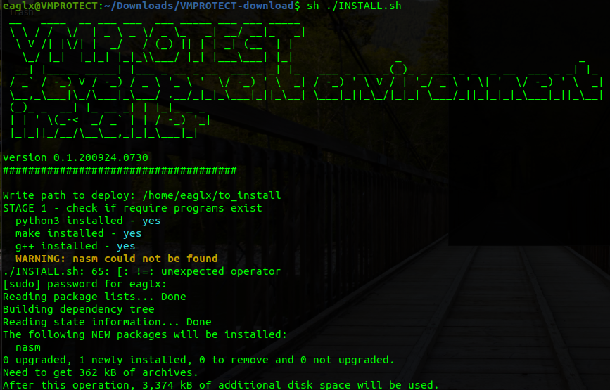
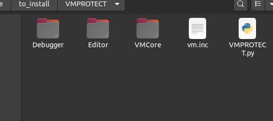
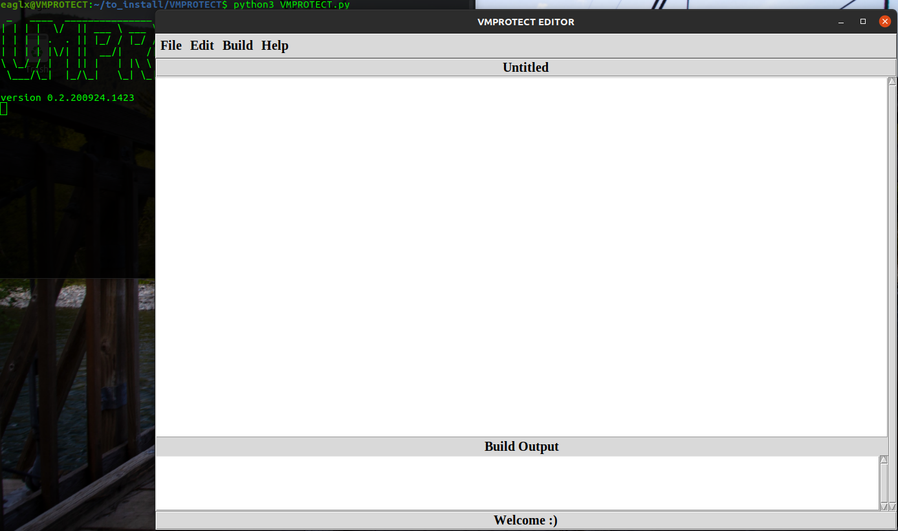
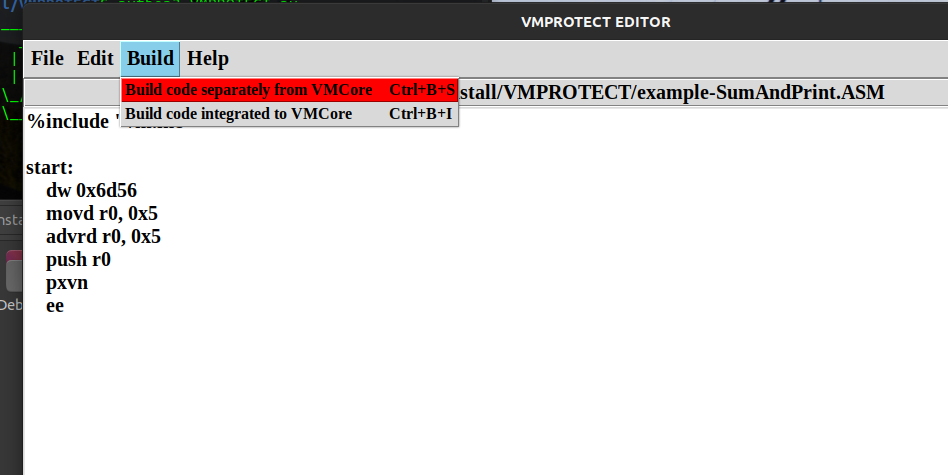
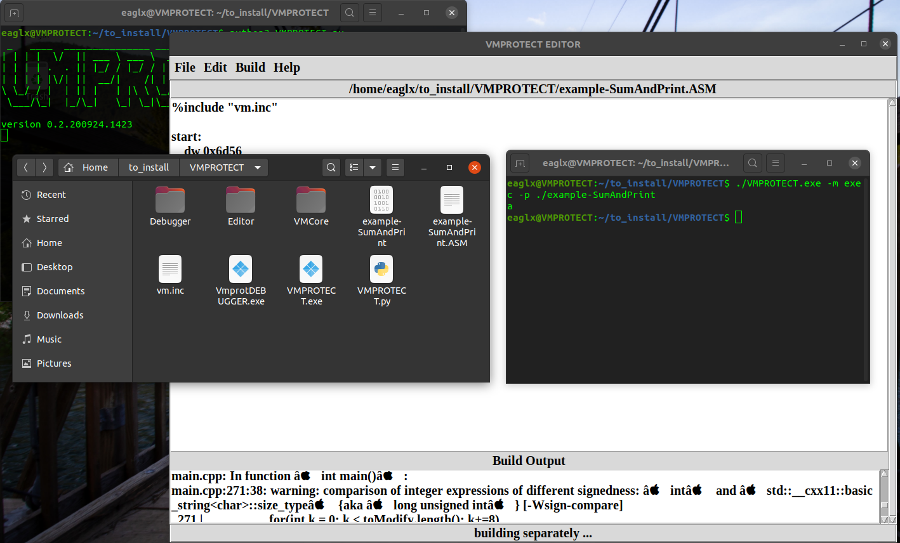
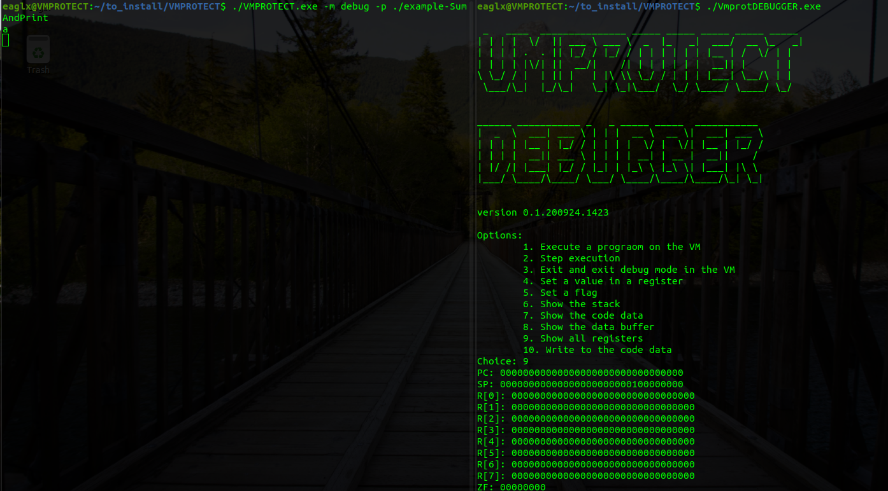
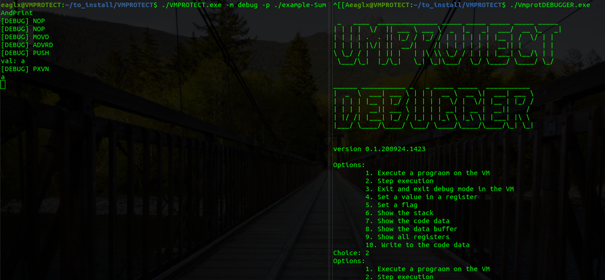

# VMPROTECT


<i>A code obfuscation method using virtual machines to protect programs</i>

<a href="https://github.com/eaglx/VMPROTECT/stargazers"></a>
<a href="https://github.com/eaglx/VMPROTECT/network/members"></a>
<a href="https://github.com/eaglx/VMPROTECT/blob/master/LICENSE"></a>
[](https://GitHub.com/eaglx/VMPROTECT/releases/)

<!----->

A virtual machine that simulates a CPU along with a few other hardware components, allows to perform arithmetic operations, reads and writes to memory and interacts with I/O devices. It can understand a machine language which can be used to program it. Virtual machines used in code obfuscation are completely different than common virtual machnines. They are very specific to the task of executing a few set of instructions. Each instruction is given a custom opcode (often generated at random).

## Table of contents
* [Requirements](#requirements)
* [Setup](#setup)
* [Editor](#editor)
* [Compiler](#compiler)
* [Debugger](#debugger)
* [VMCore](#vmcore)
  * [Args](#args)
  * [Security](#security)
  * [Documentation](#documentation)
    * [Memory](#memory)
    * [Drivers](#drivers)
      * [Sysbus](#sysbus)
    * [Registers](#registers)
    * [Instructions](#instructions)
* [Disclaimer](#disclaimer)

## Requirements
* NASM [tested on 2.13.02]
* Python3 [tested on 3.6.9]
  * Tkinter [tested on 8.6]
* g++ [tested on 7.5.0]
* make [tested on 4.1]

## Setup
A bash script was created for easier setup of the development environment. At the beginning the script checks and installs the necessary software. Next, copy files and run some unit tests. The bash script is compatible with Debian-based distributions and *Advanced Package Tool*, which handle the installation and removal of software.



After setting up the environment, the directory structure looks like in the screenshot below. There are:
* Debugger - the source code of the debugger,
* Editor - the source code of the code editor,
* VMCore - the source code of the virtual machine,
* vm.inc - the file with definitions of opcodes,
* VMPROTECT.py - start here :smile:



## Editor
The editor was written in *Python*. It is a plain text editor with no code syntax highlighting. You can write programs for *VMPROTECT* here. The window consists of a menu, a space for entering text and an output from compiling and building the program. Additionally, the editor status is shown at the bottom.



There are two options for building a program. The first mode is to compile the program into a separate file and prepare the *VMPROTECT* and *VMPROTECT-DEBUGGER* executables. The second option differs from the previous one in that it merges the compiled code with *VMPROTECT*. Then *VMPROTECT* can be executed without passing arguments.



Remember to save the source code with the extension (e.g. *asm*) because the editor doesn't support compiling without the extension. Which can lead to the unexpected operation of the editor program. The following files will be created in the directory where the file, with source code, was saved (please do not confuse the *exe* extension with *PE* files for the Windows operating system):
* compiled program file
* VMPROTECT.exe
* VmprotDebugger.exe



## Compiler
The *nasm* as compiler is used for compilation a code. Remember to include the *vm.inc* file with definitions of opcodes in your programs. Additionally, at the beginning of the code should be included magic number *0x566d*. An example program for virtual machine below.

```nasm
%include "vm.inc"   ; Or full path to this file!

start:
    dw 0x6d56
    movd r0, 0x5
    advrd r0, 0x5
    push r0
    pxvn
    ee
```

## Debugger
When debugging a program you can use a dedicated debugger for *VMPROTECT*. The debugger has following options:
1. Execute a program on the VM.
2. Step execution.
3. Exit debugger and exit debug mode in the *VMPROTECT*.
4. Set a value in a register.
5. Set a flag.
6. Show the stack.
7. Show the code data.
8. Show the data buffer.
9. Show all registers.
10. Write to the code data.

In case of option *10*, the overwritten data will start from where the *PC* register points. The debugger connects to the *VMPROTECT* using a TCP socket, default port *9313*. An example of debugging is seen in the screenshot below.



An example of debugging with the *V_DEBUG* option turned on is seen in the screenshot below.



In *vmcpu.cpp* change (uncomment *#define V_DEBUG*, see below code sample) to print more details.

```c++
#include "../include/vmcpu.hpp"

// #define V_DEBUG  <- ****uncomment this to print debug****
// #include <bitset>

VMCPU::VMCPU()
{
```

## VMCore
### Args
The *VMPROTECT* can be start with no arguments but there need to be set a code to execute in *protected.hpp*.

```c++
VBYTE ProtectedData[] = { 0xFF }; // <- HERE PASTE A CODE TO EXECUTE BY VMCPU.
```

Param *-m* set a program mode. Possible program execution modes:
* exec - normal execution,
* debug - debugging mode, you need to run *VMPROTECT-Debugger*.

Param *-p* describe a path to a file with a compiled code to execute.

Example usage of *VMPROTECT* below.

```ascii
VMPROTECT.exe -m exec -p ./example-SumAndPrint

# OR

VMPROTECT.exe -m debug -p ./example-SumAndPrint
```

### Security
The *VMCore* use (only in *Linux*) the ptrace syscall in order to implement a resistent anti debugging techniques. Patching the code wit *NOP's* will not work out of the box either, because the offset calculation must not be destroyed in order to guarantee normal execution.

```c++
offset = value;
if (ptrace(PTRACE_TRACEME, 0, 1, 0) == 0) offset = value;
if (ptrace(PTRACE_TRACEME, 0, 1, 0) == -1) offset *= value;
if (offset != value) return 0;
```

### Documentation
The VM will simulate a fictional cpu (32-bit). It has a custom instrucion set compared to x86-64.

#### Memory
The VM has 51,200 memory locations, each of which stores a 8-bit value (it can store a total of 50kb). The VM has stack, which is a separate data structure. The stack has 256 memory locations, each of which stores a 32-bit value (it can store a total of 512b).

Also, there is a data buffer which has 1024 memory locations, each of which stores a 1-bit value. This buffer will store user input.

```c++
typedef uint8_t VBYTE;
typedef uint16_t VWORD;
typedef uint32_t VDWORD;

#define CODE_DATA_SIZE 51200
#define STACK_SIZE 256
#define INPUT_BUFFER_SIZE 1024

VBYTE codeData[CODE_DATA_SIZE];
VDWORD stack[STACK_SIZE];
VBYTE dataBuffer[INPUT_BUFFER_SIZE];
```

#### Drivers
The drivers are designed to expand the *VMPROTECT*'s capabilities.

##### Sysbus
A sysbus is a driver that allows access to a filesystem. Arguments to functions pass via the stack.

FUNC | CMD | CODE | Windows | Linux | MacOS
--- | --- | --- | --- | --- | ---
createDirectory | sysdircr | 1 | YES | YES | NO |
deleteDirectory | sysdirdel | 2 | YES | YES | NO |
moveDirectory | sysdirmv | 3 | YES | NO | NO |
copyDirectory | sysdircp | 4 | YES | NO | NO |
createFile | sysfilecr | 5 | YES | YES | NO |
deleteFile | sysfiledel | 6 | YES | YES | NO |
moveFile | sysfilemv | 7 | YES | YES | NO |
copyFile | sysfilecp | 8 | YES | YES | NO |

Functions' implementation:
```c++
int createDirectory(std::string, int));
int deleteDirectory(std::string);
int moveDirectory(std::string, std::string);
int copyDirectory(std::string, std::string);
int createFile(std::string, uint8_t*, int);
int deleteFile(std::string);
int moveFile(std::string, std::string);
int copyFile(std::string, std::string);
```

Example call function use case:
```nasm
%include "vm.inc"

start:
    dw 0x6d56
    movd r1, 0x0
    movd r2, 0x0
    movd r1, path
    movd r2, data
    push r1
    push r2
    vmsysbus sysfilecr
    ee

data:
    db 0x01, 0x02, 0x03, 0x04, 0x3, 0xD
path:
    db "/home/eaglx/file.bin", 0x3, 0xD
```

#### Registers
A register is a slot for storing value on the CPU. The VM has 10 total registers, each of which is 4 bytes (32 bits). The six of them are general purpose, one has designated role as program counter and another has role as stack pointer. The VM has also two regisers ZF (Zero Flag) and CF (Carry Flag). These two provide information about the most recently executed calculation (allows to check logical conditions such as *AND*).

```c++
/* General Purpose Registers R0 -> R7 */
VDWORD R[8];
struct {
    /* Zero Flag 
        value 1 - flag is set if the result of the last comparison was zero
        value 0 - flag is not set
    */
    unsigned char ZF : 1;
    /* Carry Flag 
        value 1 - flag is set the results of the last comparison was moving
        value 0 - flag is not set
    */
    unsigned char CF : 1;
};
/* Program Counter */
VDWORD PC;
/* Stack Pointer */
VDWORD SP;
```

#### Instructions
An instruction is a command which tells the CPU (and the VM's cpu) to do some task, such compare two values. Instructions have both an opcode which indicates the kind of task to perform and a set of parameters which provide inputs to the task being performed.

```assembly
ADRR R2, R1 => 22 02 01
```

<details>
  <summary>Show full list of opcodes</summary>

OPCODE | Mnemonic and params | Description
--- | --- | ---
00  | NOP | No operation |
EE  | EE | End of code and end of the VM's cpu |
01  | MOV r<sub>dst</sub>, r<sub>src</sub> | Move from a register to a register|
02  |  MOVMB r<sub>dst</sub>, addr<sub>src</sub> | Move and extend byte from memory to a register|
03  |  MOVMW r<sub>dst</sub>, addr<sub>src</sub> | Move word from memory to a register |
04  |  MOVB r<sub>dst</sub>, byte | Move and extend byte to a register  |
05  |  MOVW r<sub>dst</sub>, word | Move word to a register |
06  |  MOVBM addr<sub>dst</sub>, r<sub>src</sub> | Move byte from a register to memory location |
07  |  MOVWM addr<sub>dst</sub>, r<sub>src</sub> | Move word from a register to memory location |
08  |  MOVMRB r<sub>dst</sub>, r<sub>src</sub> | Move and extend byte from memory to a register; get an address from a register |
09  |  MOVMRW r<sub>dst</sub>, r<sub>src</sub> | Move word from memory to a register; get an address from a register |
0A  |  MOVMD r<sub>dst</sub>, addr<sub>src</sub> | Move double word from memory to a register |
0B  |  MOVD r<sub>dst</sub>, dword | Move double word to a register |
0C  |  MOVDM addr<sub>dst</sub>, r<sub>src</sub> | Move double word from a register to memory location |
0D  |  MOVMRD r<sub>dst</sub>, r<sub>src</sub> | Move double from memory to a register; get an address from a register |
  | | |
20  |  JMP addr | Unconditional jump |
21  |  JZ addr | Jump if equal; it set up PC to the specified location if the ZF is set (1) |
22  |  JNZ addr | Jump if not equal; it set up PC to the specified location if the ZF is not set (0) |
23  |  JAE addr | Jump if above or equal; it set up PC to the specified location if the ZF is set (1) and the CF is not set (0) |
24  |  JBE addr | Jump if below or equal; it set up PC to the specified location if the ZF is set (1) and the CF is set (1) |
25  |  JB addr | Jump if below; it set up PC to the specified location if the ZF is not set (0) and the CF is set (1) |
26  |  JA addr | Jump if above; it set up PC to the specified location if the ZF is not set (0) and the CF is not set (0) |
  | | |
30  |  ADVR r<sub>dst</sub>, word | Add word value to a register |
31  |  ADRR r<sub>dst</sub>, r<sub>src</sub> | Add two registers |
32  |  ADRRL r<sub>dst</sub>, r<sub>src</sub> | Add two registers (the low byte) |
33  |  SUBVR r<sub>dst</sub>, word | Substract word value from a register |
34  |  SUBRR r<sub>dst</sub>, r<sub>src</sub> | Substract two registers |
35  |  SUBRRL r<sub>dst</sub>, r<sub>src</sub> | Substract two registers (the low byte) |
36  |  XOR r<sub>dst</sub>, r<sub>src</sub> | Xor two registers |
37  |  XOR r<sub>dst</sub>, r<sub>src</sub> | Xor two registers (the low byte) |
38  |  NOT r<sub>dst</sub>| Bitwise NOT on value in a register |
39  |  NOT r<sub>dst</sub> | Bitwise NOT on value in a register (the low byte) |
3A  |  ADVRD r<sub>dst</sub>, dword | Add double word value to a register |
3B  |  SUBVR r<sub>dst</sub>, dword | Substract double word value from a register |
3C  |  SHR r<sub>dst</sub>, count<sub>byte</sub> | Shift the bits of the operand destination to the right, by the number of bits specified in the count operand |
3D  |  SHL r<sub>dst</sub>, count<sub>byte</sub> | Shift the bits of the operand destination to the left, by the number of bits specified in the count operand |
  | | |
50  |  CMP r<sub>dst</sub>, r<sub>src</sub> | Compare two registers |
51  |  CMPL r<sub>dst</sub>, r<sub>src</sub> | Compare two registers (the low byte) |
  | | |
60  |  VMSYSBUS word | Arguments to functions pass via the stack |
  | | |
90  |  PUSH r<sub>src</sub> | Push value from a register to stack |
91  |  POP r<sub>dst</sub> | Pop value from stack to a register |
92  |  CLST | Clear the stack |
93  |  SETSP dword| Set the stack pointer to the double word value |
  | | |
A0  |  POC  | Print char without new line, the value must be at the top of the stack |
A1  |  POCN  | Print char with new line, the value must be at the top of the stack |
A2  |  TIB  | Take input and move to the data buffer, the length of the string is stored in R[7] |
A3  |  GIC r<sub>src</sub> | Get a specific char from input, that is stored in the data buffer, the value will be stored in R[7], pass the position of char via a some register |
A4  |  PIC  | Print char from input without new line, the value must be at the top of the stack |
A5  |  PICN  | Print char from input with new line, the value must be at the top of the stack |
A6  |  PXV  | Print a value in hex, the value must be at the top of the stack |
A7  |  PXVN  | Print a value in hex with a new line, the value must be at the top of the stack |

</details>

---
## Disclaimer
#### VMPROTECT is for EDUCATION and/or RESEARCH purposes only. The author takes NO responsibility and/or liability for how you choose to use this software and damages caused by this software. You bear the full responsibility for your actions.

#### By using this software, you automatically agree to the above.
---
